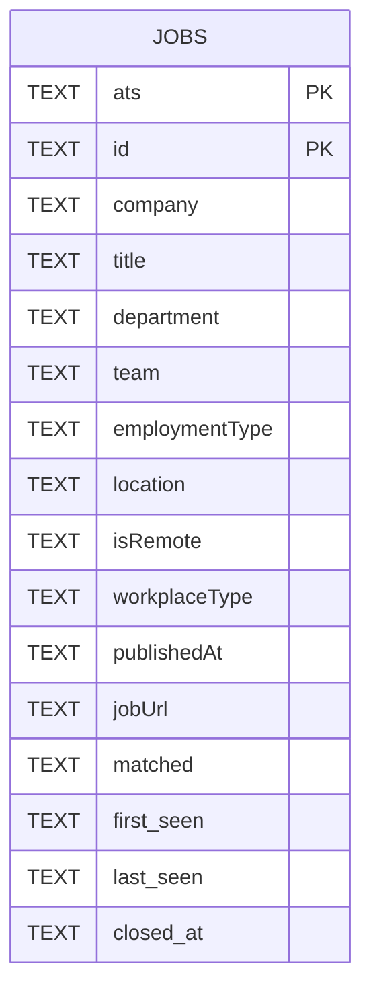
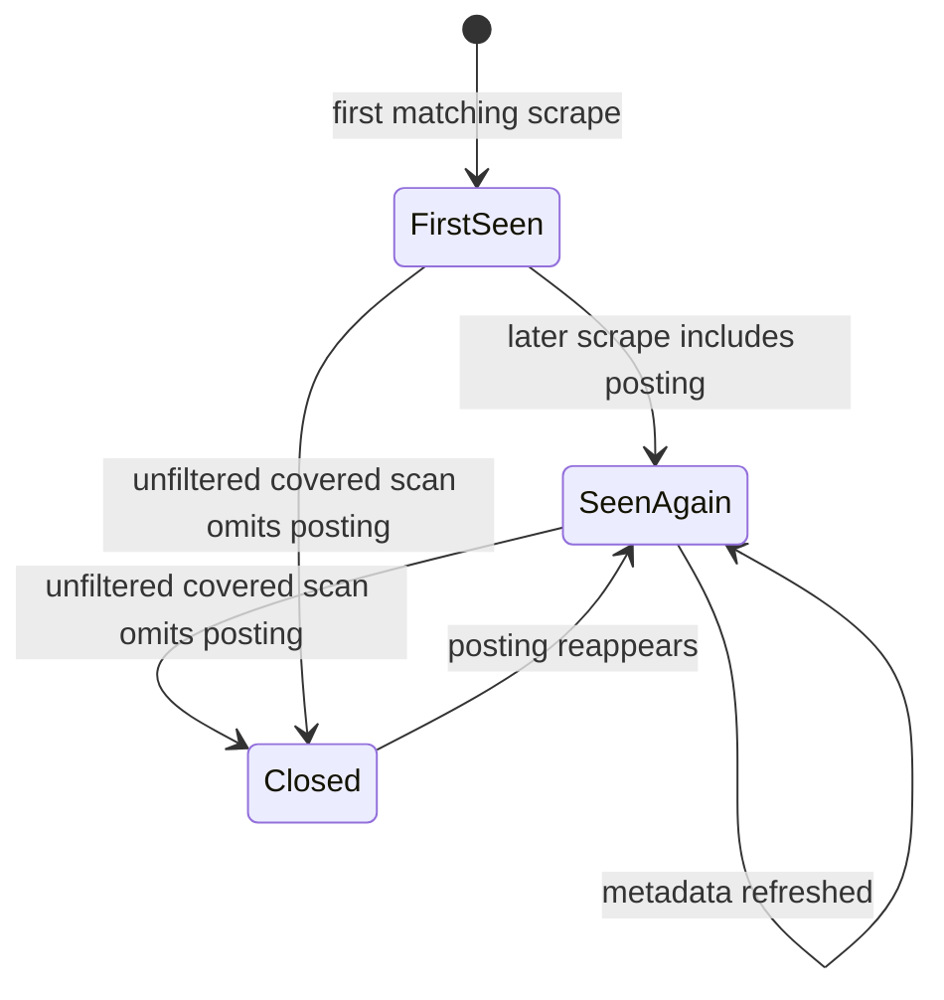

# Data model

The [job scrape workflow](../workflows/job-scrape.md) emits one flattened row per matching posting from Ashby, Greenhouse, or Lever. The same row shape is written to CSV, JSON, and SQLite, while SQLite adds cross-run lifecycle fields. Board coverage from [board discovery](../workflows/board-discovery.md) determines when disappearance can be inferred.

## Row shape

`FIELDS` in `/job_boards.py` defines the emitted columns:

- `ats`
- `company`
- `id`
- `title`
- `department`
- `team`
- `employmentType`
- `location`
- `isRemote`
- `workplaceType`
- `publishedAt`
- `jobUrl`
- `matched`

`ats` is the platform key (`ashby`, `greenhouse`, or `lever`). `company` is the board slug, not a separate legal entity lookup. `matched` is empty unless `--grep` found description fragments. The adapter layer in [job scraping](../workflows/job-scrape.md) fills fields that do not exist on a platform with empty strings so downstream CSV, JSON, and SQLite consumers can rely on one schema.

## Output files

| Output | Source behavior | Notes |
|---|---|---|
| CSV | `csv.DictWriter` with `FIELDS` | Written as UTF-8 with BOM for Excel compatibility. Default prefix is `job-boards`. |
| JSON | `json.dumps(rows, indent=2)` | Snapshot of the current query's matching rows. Default prefix is `job-boards`. |
| SQLite | `save(rows, db_path, seen_at, covered)` | Accumulates history across scrapes unless `--no-db` is set. Default file is `job-boards.db`. |
| `boards.json` | `load_boards()` and dead-board pruning | Generated per-platform board cache, intentionally ignored by git. |

Generated `*.csv`, `*.json`, and `*.db` files are ignored by `.gitignore`; `/boards.seed.json` is the only committed JSON source file.

## SQLite schema

The table is created by `_create_table()` in `/job_boards.py` with primary key `(ats, id)`. `_prepare()` creates the table, migrates older schemas, and only then creates indexes on `(ats, company)`, `last_seen`, and `closed_at`. That order matters because an index on a column the migration has not added yet cannot be created.

## Upsert rules

Rows are keyed by `(ats, id)`. Rows without an `id` are skipped. The composite key is deliberate: Greenhouse posting ids are integers while Ashby and Lever use UUID-like ids, so a bare `id` risks collisions across platforms. On conflict, `first_seen` is preserved, `last_seen` is refreshed to the current run timestamp, and most fields are overwritten because upstream titles, locations, and other posting metadata can change in place.

`matched` is the exception. If a later run has an empty `matched` value, it does not erase grep context found by an earlier `--grep` run. A later run with non-empty `matched` does update the stored context.

Opening a pre-multi-ATS database triggers a rebuild because SQLite cannot alter a primary key in place. `_prepare()` labels every existing row as `ats = 'ashby'`, carries forward compatible columns including `closed_at`, drops the old table, and renames the rebuilt table. Older databases that only lack `closed_at` get that column added before indexes are created.

## Posting lifecycle

A missing posting only means closed when the run was exhaustive for that board. `main()` passes `covered=scanned` to `save()` only when there is no title filter and no grep pattern. Filtered runs pass `covered=None`, so they never stamp `closed_at`. This rule is central to the [operations runbook](../operations/runbook.md): schedule `--all` if you want fill-rate or disappearance signals.

Closing is scoped to `(ats, company)` pairs actually scanned. If `--limit` scanned only one platform's first boards, jobs on skipped boards or other platforms must not be closed. Tests exercise filtered runs, scoped closing, and reopening when a previously closed posting reappears.

## Change guidance

Any schema or lifecycle change should be made with tests first or alongside source changes. Update [testing](../testing.md) for upsert preservation, migration from older databases, filtered-run safety, and reopen behavior. Update [operations](../operations/runbook.md) if SQL examples, output filenames, or scheduling advice change.
