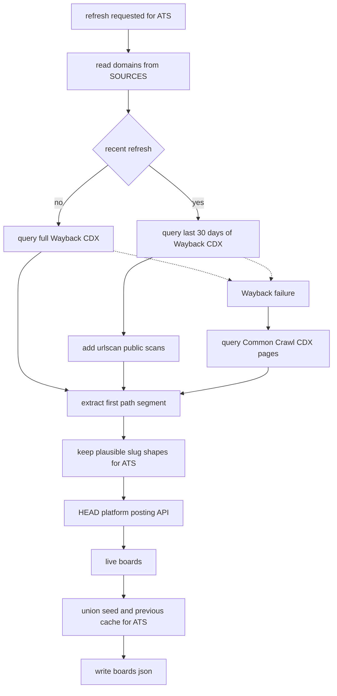

# Board discovery workflow

The [architecture overview](../architecture/overview.md) depends on this workflow to turn the absence of global ATS search endpoints into a reusable per-platform board-slug list. The [job scrape workflow](job-scrape.md) consumes the resulting `(ats, slug)` pairs and assumes they are plausible live public boards.

## Sources of board slugs

`load_boards(refresh, ats_list, concurrency, recent)` checks sources in this order:

1. If neither `--refresh-boards` nor `--refresh-recent` is set, merge `/boards.seed.json` and generated `boards.json` by platform. Later files win where they contain entries, so a generated cache can override a seed for one ATS without erasing seed-only platforms.
2. If any selected platform has cached or seeded boards, return a dictionary for the requested ATS list and print a per-platform summary; missing selected platforms get a note telling the user to run `--refresh-boards`.
3. Otherwise, or when either refresh flag is set, call `discover_boards(ats)` for each selected platform and write the generated cache to `boards.json`. `--refresh-recent` passes a 30-day Wayback window and adds urlscan.io candidates before validation.

`/boards.seed.json` is intentionally small and committed as an object keyed by `ashby`, `greenhouse`, and `lever`. It makes a fresh clone useful even when archive services are unavailable. Generated `boards.json` may contain thousands of discovered companies across vendors, so `.gitignore` excludes it.

## Discovery flow

This flow shows how full and recent refreshes share validation and cache preservation while recent refreshes add urlscan candidates.

The workflow is implemented by `candidates_from_wayback()`, `candidates_from_urlscan()`, `candidates_from_commoncrawl()`, `slug_from_url()`, `plausible()`, `board_exists()`, `discover_boards()`, and `load_boards()` in `/job_boards.py`.

## Candidate extraction and shape filtering

`SOURCES` defines the archive domains for each platform: `jobs.ashbyhq.com` for Ashby, `boards.greenhouse.io` and `job-boards.greenhouse.io` for Greenhouse, and `jobs.lever.co` for Lever. `slug_from_url()` parses the first path segment of a board URL and percent-decodes it, preserving real slugs that contain spaces such as `A1 Garage Door Service`. `_add()` deduplicates case-insensitively while keeping first-seen casing, and both Wayback and urlscan candidates flow through this same extraction path.

`plausible(slug, ats)` rejects archive noise before validation. It keeps slugs matching an alphanumeric start plus letters, numbers, spaces, dots, underscores, or hyphens up to 61 characters. It rejects known site plumbing such as `_next`, `api`, `static`, `assets`, `meeting`, `b`, and `favicon.ico`, as well as UUID-like posting IDs. The `root.` embed-path rejection is Ashby-specific, so tests verify that `root.abc` is rejected for Ashby but remains plausible for Greenhouse.

## Validation and cache preservation

`board_exists(ats, slug)` validates a candidate by issuing `HEAD` to the platform URL from `board_url()`. A 200 means the board exists, and a 404 maps to false through `NotFound`. The README calls out why this matters: `HEAD` returns status with a zero-length body, avoiding gigabytes of payload that `GET` validation would download.

After validation, `discover_boards()` unions live archive-discovered boards with every slug already known for the same ATS in `/boards.seed.json` and generated `boards.json`. This is important because archive discovery can miss valid boards that were never crawled; the README names `newtonx` as an example of a live Ashby board added through the seed. This preservation relationship is also used by the [operations runbook](../operations/runbook.md): add a missed slug to the seed to make it permanent.

## Recent refresh and archive fallback

`--refresh-recent` is the daily, additive discovery path. It calls `candidates_from_wayback()` with `RECENT_WINDOW_DAYS = 30`, which appends CDX's `from=` filter, then supplements those candidates with `candidates_from_urlscan()`. The README documents why this exists: Wayback is thorough but slow for brand-new boards, while urlscan.io indexes public scans from today and found boards that a full Wayback crawl missed. urlscan failures are logged and skipped, so they cannot erase Wayback candidates or known boards.

The README and recent commit history show the project moved to Wayback-first discovery because Wayback returned a larger, more reliable URL set. Common Crawl remains in `candidates_from_commoncrawl()` as a fallback, but it is treated carefully:

- `collinfo.json` selects the latest collection.
- Pages are read as JSONL, not a JSON array.
- The code sleeps one second between pages.
- It avoids `showNumPages`, which the README describes as expensive.
- HTTP 503 raises `RateLimited` with guidance that Common Crawl considers this client-side rate pressure.

## Change guidance

When changing this workflow, update [testing](../testing.md) fixtures for URL parsing, JSONL parsing, plausible slug filtering, per-ATS source behavior, `HEAD` validation, and any recent-refresh/urlscan parsing boundaries. When changing cache semantics, update the [data model](../architecture/data-model.md) only if coverage or closing behavior changes, and update the [operations runbook](../operations/runbook.md) if git hygiene, cadence, or seed guidance changes.
